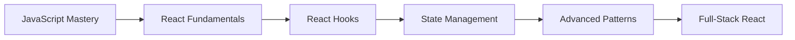

# ⚛️ React.js Learning Path - From Basics to Advanced

A comprehensive collection of projects and exercises documenting my journey to mastering React.js. This repository serves as my personal learning log and portfolio for building modern web applications with React.

  
   
  
  
  
  
  
   
  

## 📚 About This Repository

This repository tracks my progression in learning React.js ecosystem. Each project focuses on specific React concepts and patterns, with complexity increasing as my skills develop. The goal is to build production-ready React applications.

## 🎯 Learning Roadmap

### 🔰 Foundation Level (Planned 📅)

- **JSX & Components** - Understanding JSX syntax and component structure
- **Props & State** - Data passing and component state management
- **Event Handling** - User interactions and event management
- **Conditional Rendering** - Dynamic content display

### 🧩 Intermediate Level (Planned 📅)

- **React Hooks** - useState, useEffect, useContext, custom hooks
- **Component Lifecycle** - Understanding component lifecycle methods
- **Forms Handling** - Controlled components and form validation
- **React Router** - Client-side routing and navigation

### ⚡ Advanced Level (Planned 📅)

- **State Management** - Context API, Redux, Zustand
- **Performance Optimization** - Memoization, lazy loading, code splitting
- **Testing** - Jest, React Testing Library
- **Advanced Patterns** - Higher-Order Components, Render Props
- **Next.js** - Server-side rendering and full-stack React

## 📊 Progress Overview

## 🛠️ Technology Stack

- **Frontend Framework:** React.js
- **Language:** JavaScript (ES6+)
- **Styling:** CSS3, CSS Modules, Styled Components
- **Build Tools:** Create React App, Vite
- **Version Control:** Git & GitHub
- **Tools:** VS Code, Chrome DevTools

## 🏗️ Repository Philosophy

This repository follows a **progressive learning approach** where complexity increases gradually. Each project focuses on specific React concepts and serves as a building block for more advanced applications.

## 🚦 Current Focus

Currently strengthening JavaScript fundamentals before diving deep into React concepts. Strong foundations ensure better understanding of React's core principles.

## 🤝 Contributing & Feedback

This is primarily a personal learning journey, but suggestions and constructive feedback are always welcome! If you have ideas for React concepts or projects I should explore, please open an issue.

## 📜 License

This learning repository is open source and available under the [MIT License](LICENSE).

---

**Happy Coding!** 🚀

_"The only way to learn a new programming language is by writing programs in it."_ - Dennis Ritchie
